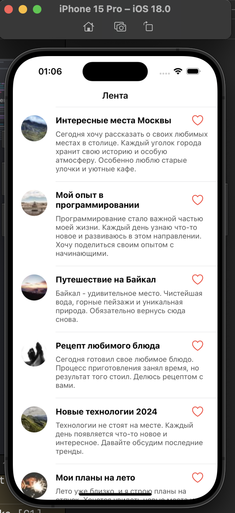
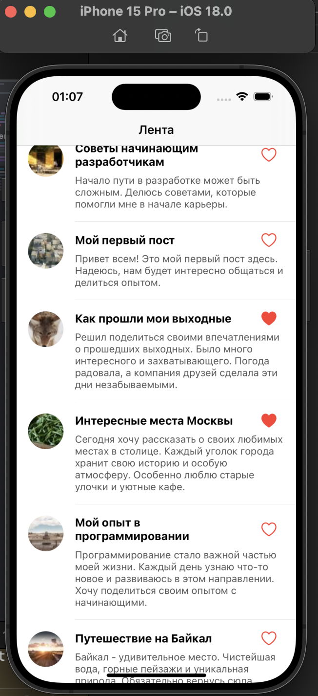

# SocialTestApp

Тестовое приложение - лента социальной сети с возможностью просмотра постов, лайков и работы в оффлайн-режиме.

## 📱 Скриншоты

<div align="center">
  
  
</div>

## 🏗 Архитектура

Проект построен с использованием архитектуры MVVM (Model-View-ViewModel):

### Models
- `Post` - модель данных поста
- `PostEntity` - CoreData сущность для хранения постов
- Отвечают за представление данных и бизнес-логику

### Views
- `FeedViewController` - основной экран ленты
- `PostTableViewCell` - ячейка для отображения поста
- Построены программно с использованием AutoLayout
- Отвечают только за отображение UI и обработку пользовательских действий

### ViewModels
- `FeedViewModel` - управляет данными и состоянием ленты
- Обеспечивает связь между View и Model
- Содержит бизнес-логику и обработку данных

### Services
- `NetworkManager` - работа с сетевыми запросами
- `CoreDataManager` - управление локальным хранилищем
- `ContentLocalizationService` - локализация контента

## 🛠 Технологии

- **Swift 5**
- **UIKit**
  - Программный UI без использования Storyboard/XIB
  - AutoLayout для адаптивного интерфейса
  - UITableView для отображения ленты
  - Pull-to-refresh
- **CoreData**
  - Хранение постов
  - Сохранение состояния лайков
  - Поддержка оффлайн-режима
- **Alamofire 5.10.2**
  - Работа с сетевыми запросами
  - Загрузка данных с пагинацией
- **URLSession**
  - Загрузка изображений для аватарок

## ✨ Основные функции

1. Загрузка и отображение постов
   - Заголовок
   - Текст поста
   - Аватарка пользователя
2. Поддержка лайков с сохранением состояния
3. Pull-to-refresh для обновления ленты
4. Пагинация (подгрузка при скролле)
5. Работа в оффлайн-режиме
6. Кастомные анимации

## 🚀 Установка и запуск

1. Клонируйте репозиторий:
```bash
git clone https://github.com/ваш-username/SocialTestApp.git
```

2. Откройте `SocialTestApp.xcodeproj`

3. Проект использует Swift Package Manager для управления зависимостями. Все зависимости будут установлены автоматически при первом открытии проекта.

4. Выберите симулятор или устройство и нажмите Run (⌘R)

## 📋 Требования

- iOS 14.0+
- Xcode 13.0+
- Swift 5.0+


